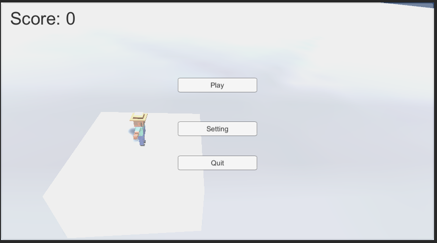
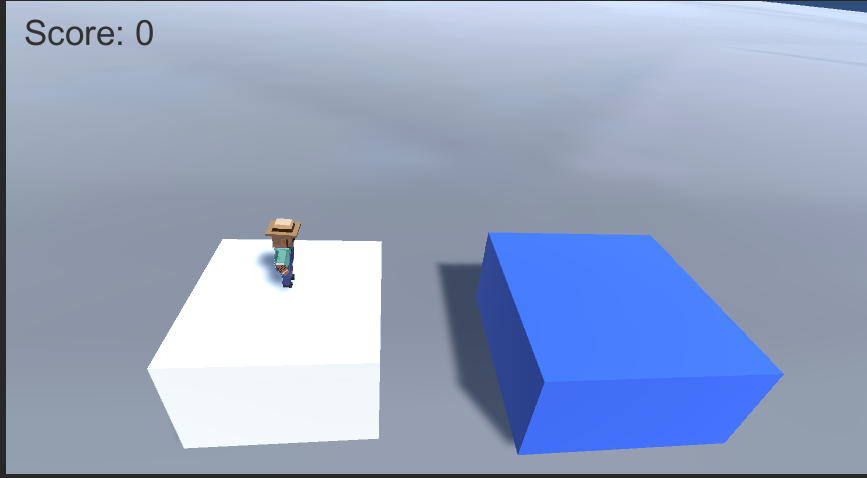
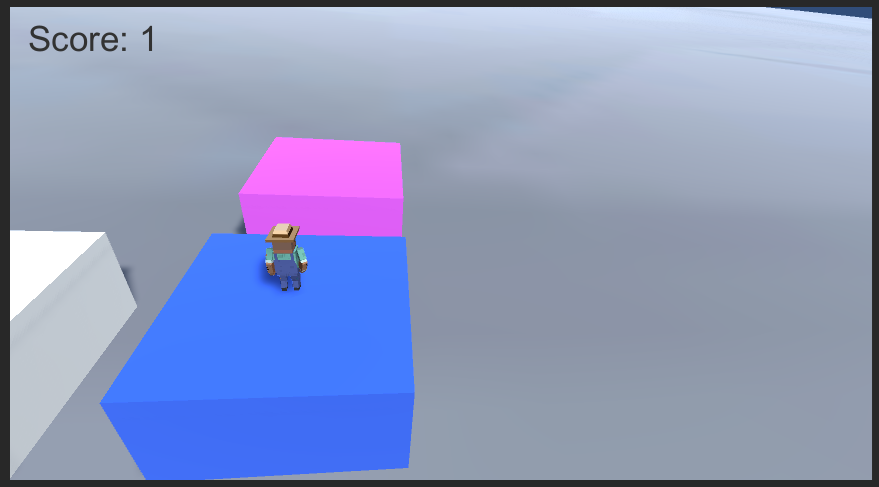

# Jumping

My first jumping game made with Unity

I named my program "Jumping". As the name suggests, the player only needs to press the SPACE key to control the character's power and jump to the next stage as much as possible, until the character falls on the ground. The design inspiration came from one of the mini-programs in the WeChat app. Since I enjoyed playing this game, I decided to create my own version of this jumping game using the Unity engine.

I used the assets from the course: Week-6_StarterFiles.unitypackage and DOTween (HOTween v2). The game was created using Unity Engine, Version 2020.2.6f1.

The following is the UI panel for players to choose to play the game or quit the application. I did not give any function to the setting button because I had no idea what to put in it. I may update it in the future.

This is the game scene.

The player can press the SPACE key on the keyboard to control the character's power and jump to the next stage. While the player presses the key, there is a simple animation of the current stage and a particle animation to indicate the power accumulation. Only acceptable power of jumping can safely reach the next stage. Moreover, the character has a jumping animation in the air.

Once the character successfully arrives at the next stage, the new stage will be generated. It is still a cube, but it has a different size and color. The character will also change direction for the next jump. The score will be recorded in the upper-right corner of the screen. If the character falls on the ground, the game scene will reload, and the player will start a new game.

Finally, there is a major issue that once I build the scenes and run the game, the application will get stuck in the menu scene. I cannot find out the reason yet, because everything goes well inside Unity. However, if I only build the game with the game scene, it works.
